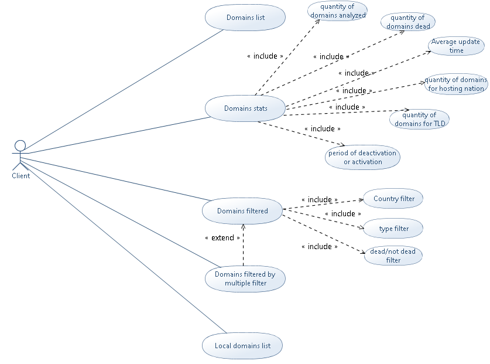
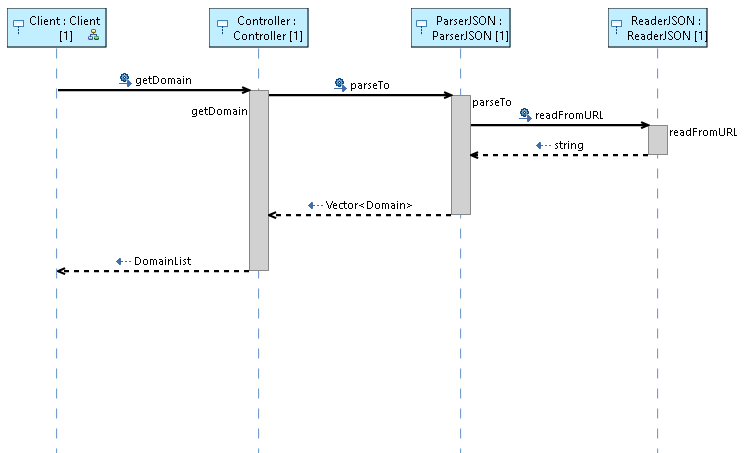
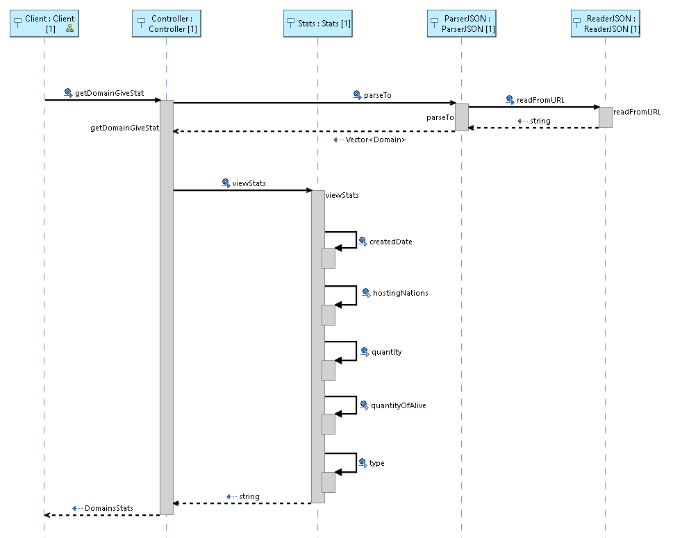
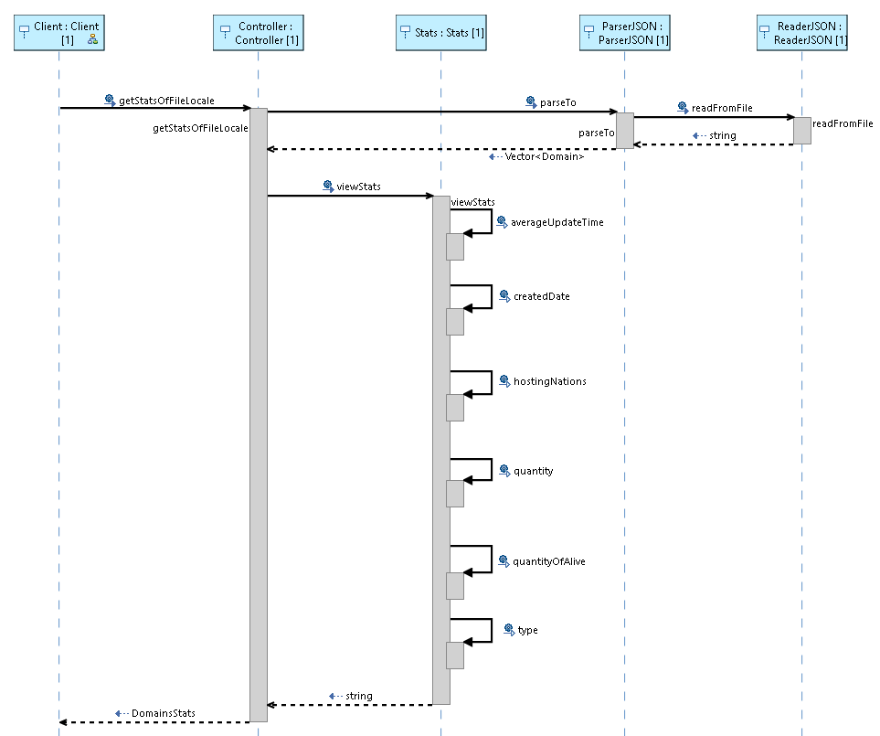
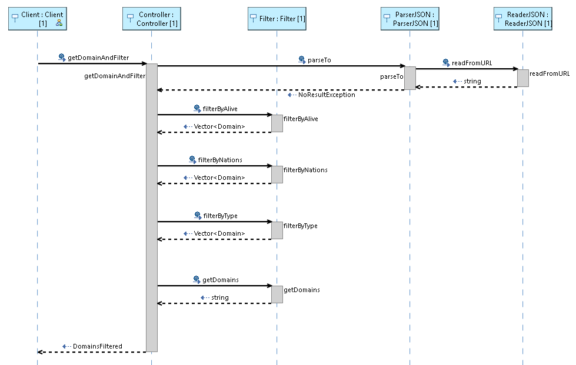

# Progetto_Programmazione
## Introduzione:

L'obbiettivo del progetto è stato quello di creare una REST API che implementasse l'API DOMAINS DB.

API Reference: https://api.domainsdb.info/v1/

DOMAINS DB permette l'accesso ad un lista di siti con le loro seguenti caratteristiche:
- Dominio
- Data di creazione
- Data di aggiornamento
- Nazione di hosting
- Se il sito è attivo o no

Il nostro programma permette all'utente di sapere quanti siti contengono il suo cognome, di sapere le statistiche riguardanti i siti trovati e inoltre di filtrarli.

## ROTTE:

 Tipo di chiamata:     |  Chiamata:             |  Descrizione:
---------------------- | ---------------------- | ---------------------------------------------------
GET                    | /{cognome}             | Lista dei siti contententi il cognome 
GET                    | /{cognome}/stats       | Statistiche dei siti contenenti il cognome
GET                    | /{cognome}/filter      | Lista filtrata dei domini contenenti il cognome
GET                    | /localstats            | Statistiche dei domini dal file locale
POST                   | /{cognome}/filter      | Lista filtrata dei domini con la possibilità di concatenare più filtri 

**!** Sostituire {cognome} con un cognome
La chiamata **GET /{cognome}/filter** da la possibilita di un filtraggio semplice, i parametri sono opzionali e possono essere:
type(ovvero il TLD es. com org net) nation(la nazione di hosting es. IT FR UK) e alive( true(attivo) o false(disattivo) ).
La chiamata **GET /localstats** utilizza il file "api.txt" dentro il progetto.
La chiamata **POST /{cognome}/filter** a differenza di quella di tipo **GET** dà la possibilità di concatenare più filtri.

## CONFIGURAZIONE:

 - Per utilizzare il programma è necessario importare il progetto dentro Eclipse.
 - Lanciare il progetto come SpringBootApplication,
 - Lanciare Postman per effettuare richieste GET/POST disponibili nelle rotte.
 
### ESEMPI

**1) GET /{cognome}** (localhost:8080/trump) 
```json
[
    {
        "domain": "trump-1024.store",
        "createDate": "2020-12-30T07:12:25.944773",
        "updateDate": "2020-12-30T07:12:25.944776",
        "country": "null",
        "isDead": "false"
    },
    {
        "domain": "trump-today.news",
        "createDate": "2020-12-30T07:05:20.720367",
        "updateDate": "2020-12-30T07:05:20.720372",
        "country": "DE",
        "isDead": "false"
    }
    
    ...
    
    {
        "domain": "president-trump-twittertwit-in-chief.news",
        "createDate": "2020-12-30T07:05:16.469030",
        "updateDate": "2020-12-30T07:05:16.469036",
        "country": "US",
        "isDead": "false"
    }
]
```
**2) GET /{cognome}/stats** (localhost:8080/trump/stats)
```json
{
    "quantity": 4,
    "quantityOfAlive": 4,
    "averageUpdateTime": "0Y0D",
    "hostingNations": {
        "DE": 2,
        "RU": 2
    },
    "type": {
        "news": 3,
        "app": 1
    },
    "createdDate": {
        "2020-12": 4
    }
}
```
**3) GET /{cognome}/filter** (localhost:8080/trump/filter?type=com&nation=US&alive=true)
```json
[
    {
        "domain": "old-trump.com",
        "createDate": "2020-12-30T07:12:25.944773",
        "updateDate": "2020-12-30T07:12:25.944776",
        "country": "US",
        "isDead": "false"
    }
]
```
**4) GET /lolcastats** (localhost:8080/localstats)
```json
    {}
```
**5) POST /{cognome}/filter** (inserire il body formato JSON)
Per default si effettua un AND tra gli attributi, se si vuole una OR specificare con "logica":"or".
i campi disponibili sono:
    domain, type, nation, alive, isDead, updateDate, createDate.
i operatori disponibili sono:
    "eq" "not" "and" "or"
    "eq" e "not" chiedono un solo valore
    invece "and" e "or" chiedono anche[] 
**esempio del body**
```json
{

  "logica":"or",
  
  "type":{"or":\["com","it","fr","uk"]},
 
  "alive":{"eq":"true"}
  
}
```

## Diagrammi UML:

### Diagramma dei casi d'uso



### Diagramma del package controller
 


### Diagramma del package model


### Diagramma del package service


### Diagramma del package util


### Diagramma del package exception


## Diagrammi di sequenza

### Diagramma della rotta GET/{cognome} 



### Diagramma della rotta GET/{cognome}/stats



### Diagramma della rotta GET/localstats



### Diagramma della rotta GET/{cognome}/filter


