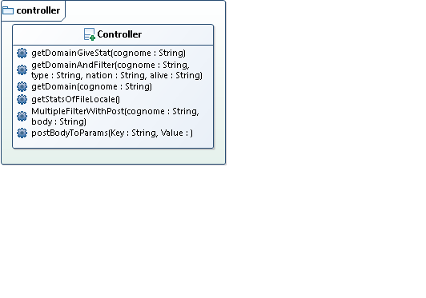
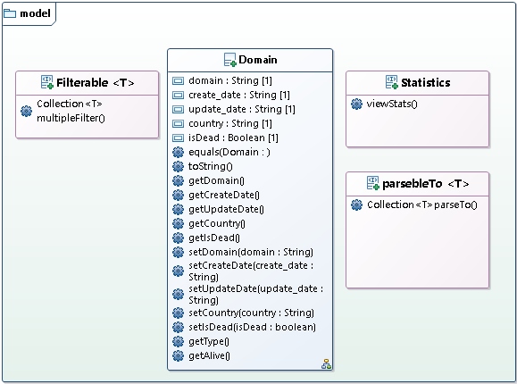
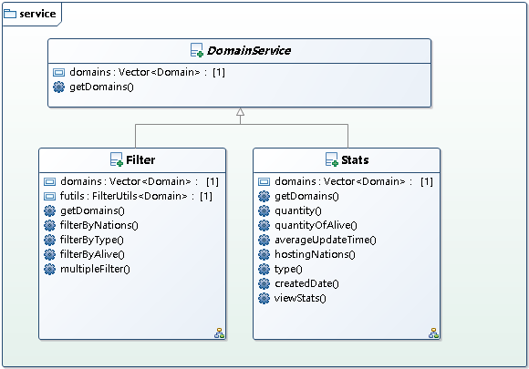
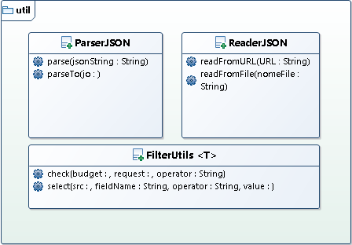
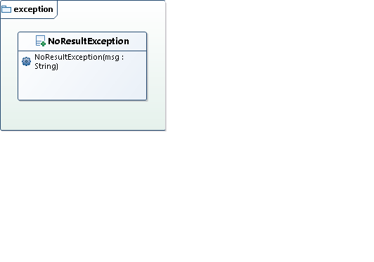

# Progetto_Programmazione
## Diagrammi package e classi UML:

### Diagramma del package controller
 

### Diagramma del package model

### Diagramma del package service

### Diagramma del package util

### Diagramma del package exception

## ROTTE:
GET /{cognome} // elenco domini non filtrati

GET /{cognome}/stats

GET /{cognome}/filter?type=com&nation=it&alive=true

GET /localstats

POST /{cognome}/filter  // Filtro multiplo
{
  "logica":"or",
  "type":{"or":\["com","it","fr","uk"]},
  "alive":{"eq":"true"}
}

